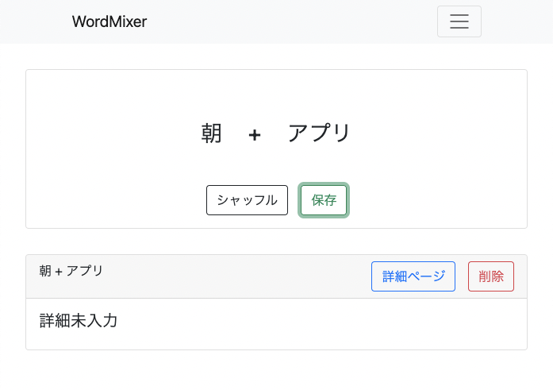

# アイデア作成アプリ　WordMixer

## WordMixerとは？
WordMixerとは、言葉の組み合わせからアイデアを作出するアプリです。
* 新しいアプリを作ろうと思ったが、どんなアプリを作ろう？
* ブログのネタが思いつかなくて困っている
* 大喜利（写真で一言のようなボケ）で奇想天外な状況が思い浮かばない

こんな人達の悩みを解決できるのではないかと思い、作成しました。

http://54.65.122.34:5000/login

### システム構成図

## 使用方法
できることは次の3つです
* ログイン
* 単語の編集
* アイデアの編集

### ログイン
ユーザーネームとパスワードを使ってログインできます。
こちらのデータをお使いください。

ユーザーネーム：keigo
パスワード：158281872keigo

### 単語の編集
次に、アイデアの元となる単語を登録していきます。
入力欄から、単語が登録されます。

### アイデアの編集
単語をいくつか登録したところで、アイデアを探してみましょう。
ナビゲーションバーからアイデアの編集画面に移り、単語を組み合わせていきます。

詳細ページでは、アイデアから思いついた詳細など、思いついたことを自由に記述できます。

## 使用した技術

### フロントエンド　React
高頻度でフォームを使うので、いちいちリロードしなくても良いようにできればと思いました。
調べてみた結果、Reactが適切だと思い使用しました。

### バックエンド　Node.js
フロントエンドでReactを使っているので、MERNスタックで揃えて作ってみようと思いました。

M:mongoDB(データベース)

E:Express(Webアプリフレームワーク)

R:React(フロントエンドのライブラリ)

N:Node.js(JavaScriptランタイム)

テストコードには、Jestを使用しました。
CIには、GitHub Actionsを使用しています。

デプロイには、Docker、AWSのECSを使ってみました。

## 作成のきっかけ
私は、アイデアが思い浮かばずに実際に行動に移せない歯痒い経験を何度もしてきました。

ある日本を読んでいると、こんな文がありました。
>互いに関連のない言葉を書いたカードを何枚もめくり、その束の中から適当に２枚引き、書かれていた言葉を組み合わせて電子翻訳機のアイディアを得たそうです。
https://www.amazon.co.jp/%E3%81%AA%E3%81%9C%E3%80%81%E3%81%82%E3%81%AA%E3%81%9F%E3%81%AE%E8%A9%B1%E3%81%AF%E3%81%A4%E3%81%BE%E3%82%89%E3%81%AA%E3%81%84%E3%81%AE%E3%81%8B-%E7%BE%8E%E6%BF%83%E9%83%A8-%E9%81%94%E5%AE%8F/dp/4860636740/ref=tmm_pap_swatch_0?_encoding=UTF8&qid=1648253162&sr=1-1

一回一回紙に書いていたのでは時間がかかりますし、持ち運びもしづらいでしょう。スマホやパソコンで思いのままにアイデアを出せるようにと思い、作成しようと思いました。
